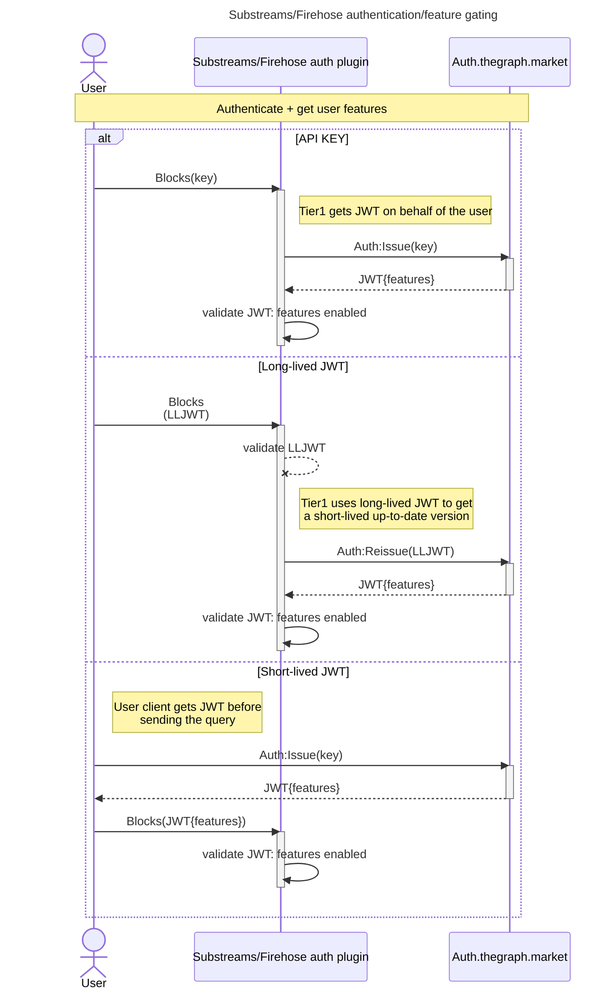
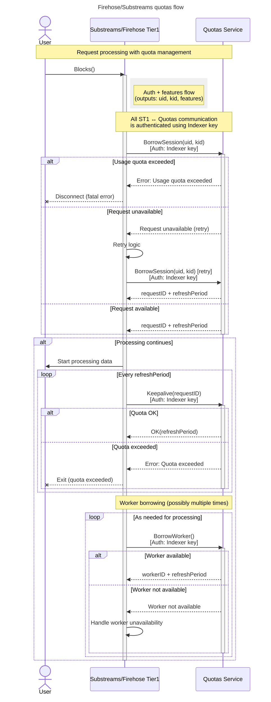

# Auth flow

```mermaid
sequenceDiagram
    title Substreams/Firehose authentication/feature gating

    actor User
    participant ST1 as Substreams/Firehose auth plugin
    participant Auth as Auth.thegraph.market

        Note over User, Auth: Authenticate + get user features

        alt API KEY
            User->>ST1: Blocks(key)
            activate ST1
            Note right of ST1: Tier1 gets JWT on behalf of the user
            ST1->>Auth: Auth:Issue(key)
            activate Auth
            Auth-->>ST1: JWT{features}
            deactivate Auth
            ST1->>ST1: validate JWT: features enabled
            deactivate ST1

        else Long-lived JWT
            User->>ST1: Blocks<br/>(LLJWT)
            activate ST1
            ST1--xST1: validate LLJWT
            Note right of ST1: Tier1 uses long-lived JWT to get<br/>a short-lived up-to-date version
            ST1->>Auth: Auth:Reissue(LLJWT)
            activate Auth
            Auth-->>ST1: JWT{features}
            deactivate Auth
            ST1->>ST1: validate JWT: features enabled
            deactivate ST1

        else Short-lived JWT
            Note right of User: User client gets JWT before<br/>sending the query
            User->>Auth: Auth:Issue(key)
            activate Auth
            Auth-->>User: JWT{features}
            deactivate Auth
            User->>ST1: Blocks(JWT{features})
            activate ST1
            ST1->>ST1: validate JWT: features enabled
            deactivate ST1
        end
```

# Session / workers quotas management

```mermaid
sequenceDiagram
    title Firehose/Substreams quotas flow

    actor User
    participant ST1 as Substreams/Firehose Tier1
    participant Quotas as Quotas Service

    Note over User, Quotas: Request processing with quota management

    User->>ST1: Blocks()
    activate ST1

    rect rgb(240, 240, 240)
        Note right of ST1: Auth + features flow<br/>(outputs: uid, kid, features)
    end

    Note over ST1, Quotas: All ST1 ↔ Quotas communication<br/>is authenticated using Indexer key

    ST1->>Quotas: BorrowSession(uid, kid)<br/>[Auth: Indexer key]
    activate Quotas

    alt Usage quota exceeded
        Quotas-->>ST1: Error: Usage quota exceeded
        ST1--xUser: Disconnect (fatal error)

    else Request unavailable
        Quotas-->>ST1: Request unavailable (retry)
        ST1->>ST1: Retry logic
        ST1->>Quotas: BorrowSession(uid, kid) [retry]<br/>[Auth: Indexer key]
        Quotas-->>ST1: requestID + refreshPeriod

    else Request available
        Quotas-->>ST1: requestID + refreshPeriod
    end
    deactivate Quotas

    alt Processing continues
        ST1->>User: Start processing data

        loop Every refreshPeriod
            ST1->>Quotas: Keepalive(requestID)<br/>[Auth: Indexer key]
            activate Quotas
            alt Quota OK
                Quotas-->>ST1: OK(refreshPeriod)
            else Quota exceeded
                Quotas-->>ST1: Error: Quota exceeded
                ST1--xUser: Exit (quota exceeded)
            end
            deactivate Quotas
        end

        Note over ST1, Quotas: Worker borrowing (possibly multiple times)

        loop As needed for processing
            ST1->>Quotas: BorrowWorker()<br/>[Auth: Indexer key]
            activate Quotas
            alt Worker available
                Quotas-->>ST1: workerID + refreshPeriod
            else Worker not available
                Quotas-->>ST1: Worker not available
                ST1->>ST1: Handle worker unavailability
            end
            deactivate Quotas
        end
    end

    deactivate ST1
```
